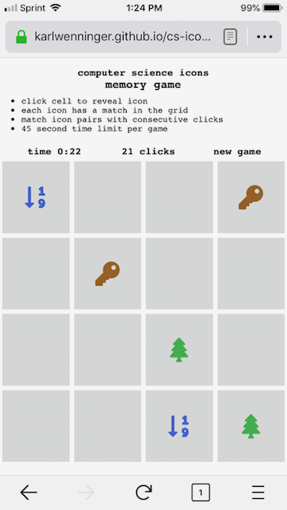

[Play the game!](https://karlwenninger.github.io/cs-icons-flip-card-game/)	

 

## CS Icons Flip Card Game

* Click/tap to reveal hidden icon in cell
* Each icon in the grid has a match
* Match icon pairs with consecutive clicks
* 45 second time limit per game
### Each icon represents a common computer science term, see if you can figure it out!

## Built With

* JavaScript
* CSS
* HTML

## Authors

* **Karl Wenninger** - [karlWenninger](https://github.com/karlWenninger)

## License

This project is licensed under the MIT License - see the [LICENSE.md](LICENSE.md) file for details
